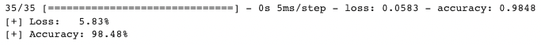

## Overview

This is a neural network model that can detect spam messages. This simple model can analyze text data and filter out useless information with an accuracy above 95%. Also, I added a callback that records the performance and accuracy for each epoch during training.

## Dataset

https://www.kaggle.com/datasets/uciml/sms-spam-collection-dataset
